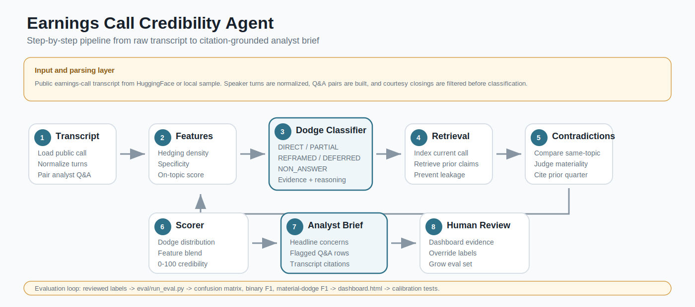
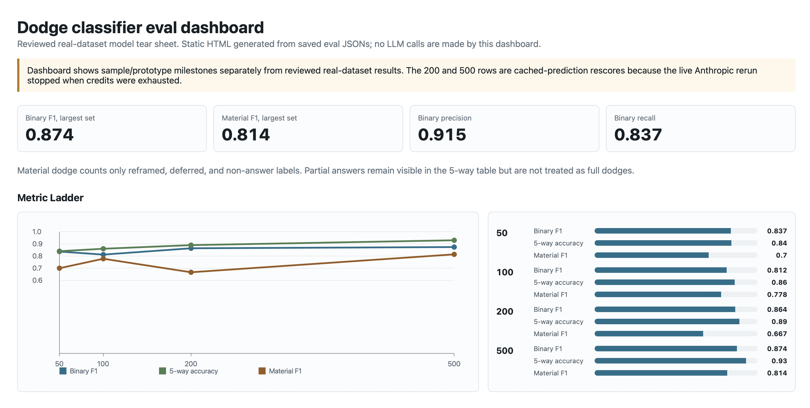
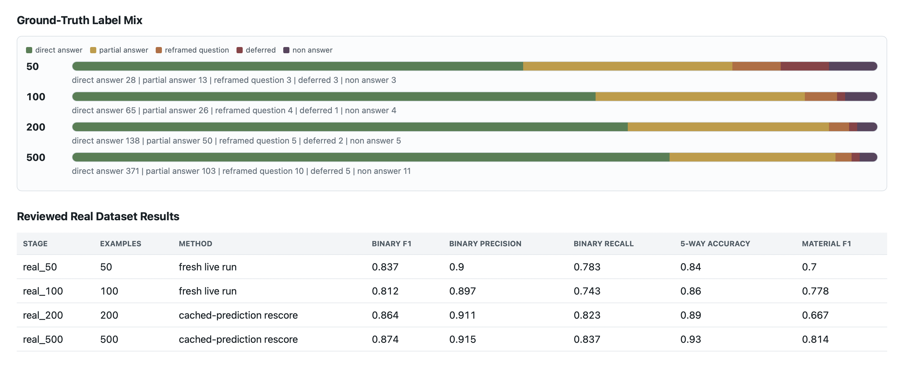
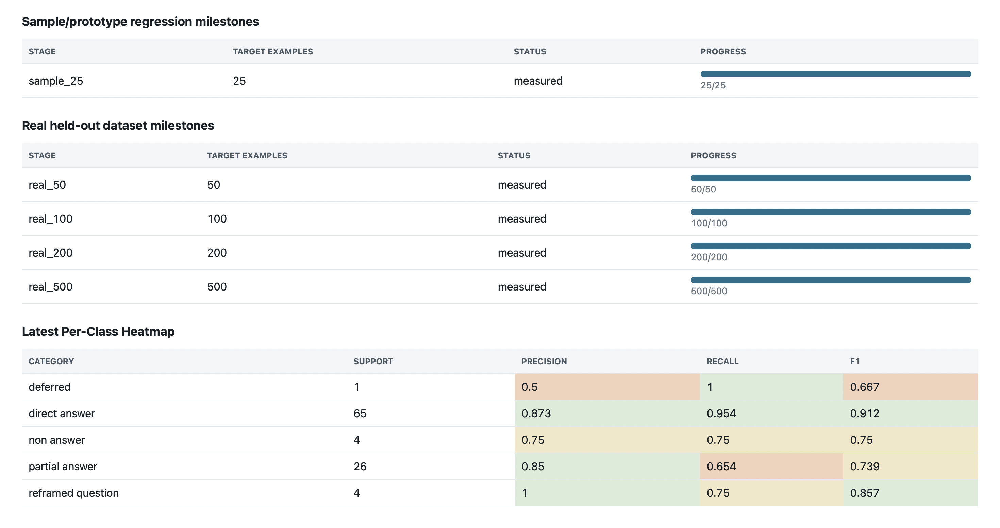

# Earnings Call Credibility Intelligence Agent

A multi-agent system that turns a 60-minute earnings call into a 2-minute,
analyst-ready brief, flagging where management **hedged**, **contradicted
prior quarters**, or **dodged analyst questions**. Every flagged Q&A item is
grounded in transcript evidence so a human analyst can verify or override it.

This project is deliberately positioned as a **teardown prototype**, not a
startup pitch. It demonstrates the kind of internal AI tool a bank,
asset-management firm, or fundamental hedge fund could build to fill a gap in
commercial earnings-research workflows: not just what management said, but how
directly they answered what analysts actually asked.

---

## Table of Contents

- [The Problem](#the-problem)
- [The Core Signal](#the-core-signal)
- [Architecture](#architecture)
- [Quickstart](#quickstart)
- [Run On Real Calls](#run-on-real-calls)
- [Evaluation Results](#evaluation-results)
- [Dashboard](#dashboard)
- [Calibration Story](#calibration-story)
- [Compliance And Limitations](#compliance-and-limitations)
- [References](#references)

---

## The Problem

Every quarter, analysts process dozens of earnings calls under time pressure.
Transcription and summary are mostly solved. The hard question a portfolio
manager asks the next morning is different:

> Did management dodge anything? Were they hedging? Did anything change from
> last quarter?

Answering that requires close-reading the Q&A, comparing management language
against prior calls, and separating normal disclosure discipline from true
evasion. Existing tools are strong at transcript search and summarization, but
they generally do not produce a structured, evidence-grounded taxonomy of how
management answered each analyst question.

## The Core Signal

The differentiator is the Q&A dodge classifier. Each analyst question is paired
with management's response and classified into one of five categories:

| Category | Meaning |
|---|---|
| `direct_answer` | The primary question was answered with concrete, usable detail |
| `partial_answer` | The executive engaged, but the core ask remained materially unresolved |
| `reframed_question` | The executive answered a related-but-different question |
| `deferred` | The executive explicitly punted to IR, legal constraints, offline follow-up, or a future period |
| `non_answer` | The executive gave boilerplate, procedural language, or no substantive engagement |

The rubric uses a **primary-question doctrine**: analysts often stack a main
question with secondary forward-looking add-ons. The classifier scores the
primary question, not every clause. If management gives concrete information on
the main ask but declines a metric the company never guides to, that is normal
disclosure discipline, not automatically a dodge.

The full brief combines three signals:

1. **Q&A dodge classification** with label, confidence, quote, and reasoning.
2. **Cross-quarter contradiction detection** via retrieval over prior calls.
3. **Composite credibility score** blending dodge distribution and classical
   linguistic features such as hedging density, specificity, on-topic
   similarity, and script adherence.

## Architecture



```text
EarningsCall transcript
        |
        v
+-------------------+
| Feature Extractor |  Hedging, specificity, on-topic similarity,
|                   |  script adherence, Loughran-McDonald features
+---------+---------+
          |
          v
+-------------------+
| Dodge Classifier  |  Per Q&A pair -> DodgeLabel + confidence + evidence
+---------+---------+
          |
          v
+-------------------+
| Index Self        |  Store current call for future-quarter retrieval
+---------+---------+
          |
          v
+-------------------+
| Contradiction     |  Retrieve prior same-company claims and judge conflict
+---------+---------+
          |
          v
+-------------------+
| Scorer            |  Blend labels + features into 0-100 credibility score
+---------+---------+
          |
          v
+-------------------+
| Brief Writer      |  Citation-grounded analyst memo
+---------+---------+
          |
          v
AnalystBrief -> CLI / Streamlit / static eval dashboard
```

Design choices:

- **Typed schemas everywhere.** Agent inputs and outputs are Pydantic models,
  so LLM responses are validated instead of silently accepted.
- **Classical features before LLM calls.** Cheap NLP features give the model a
  calibrated prior and provide independent diagnostics.
- **Deterministic guards for obvious cases.** Procedural closings, explicit
  punts, and normal disclosure-discipline patterns are handled before or around
  the LLM to reduce avoidable variance.
- **LangGraph orchestration.** Each node is independently traceable and
  retryable.
- **Local Chroma vector store.** Development is zero-config; the retrieval
  interface can be swapped for a production vector database later.
- **Audit logging.** LLM calls are logged with model, prompt hash, response
  hash, latency, schema, and success state.

## Quickstart

```bash
git clone <your-fork-url> earnings-credibility-agent
cd earnings-credibility-agent
python -m venv .venv
source .venv/bin/activate
pip install -r requirements.txt

cp .env.example .env
# Add ANTHROPIC_API_KEY or OPENAI_API_KEY to .env
```

Run the offline tests:

```bash
.venv/bin/python -m pytest tests -q
```

Current local result:

```text
33 passed, 7 skipped
```

The skipped tests are live LLM calibration guards. Run them only when an API
key is configured:

```bash
RUN_LLM_TESTS=1 .venv/bin/python -m pytest tests/test_calibration.py -v
```

Build and run the offline sample:

```bash
.venv/bin/python scripts/build_sample.py
.venv/bin/python scripts/demo.py --sample
```

Launch the Streamlit app:

```bash
streamlit run app.py
```

## Run On Real Calls

The real-call path streams from the public HuggingFace dataset
`kurry/sp500_earnings_transcripts`.

```bash
# Optional: index prior quarters for contradiction detection
.venv/bin/python scripts/ingest.py --tickers AAPL --years 2023 2024 --limit 8

# Analyze one real call
.venv/bin/python scripts/demo.py --ticker AAPL --year 2024
```

If HuggingFace prints an unauthenticated-request warning, the run can still
work; setting `HF_TOKEN` just improves rate limits.

## Evaluation Results

There are two different evaluation tracks. They should not be mixed.



### Prototype Regression Set

The original calibration set is `eval/labeled_set.jsonl`.

| Set | Examples | Labeling | Binary F1 | 5-way accuracy | Purpose |
|---|---:|---|---:|---:|---|
| Prototype regression | 30 | Single-rater, calibration-informed | 0.973 | 0.867 | Guard the rubric against known regressions |

This is a regression result. Some
examples were added during calibration, so the number is useful for preventing
known failures from returning, not for claiming generalization.

### Reviewed Real-Dataset Results

The current real evaluation files are reviewed, single-rater held-out-style
sets drawn from real earnings calls. They are more meaningful than the
prototype set, but still not final model-risk evidence because inter-rater
agreement has not yet been measured.



| Dataset | Method | Binary F1 | Precision | Recall | 5-way accuracy | Material-dodge F1 |
|---:|---|---:|---:|---:|---:|---:|
| 50 reviewed examples | Fresh live Anthropic run | 0.837 | 0.900 | 0.783 | 0.840 | 0.700 |
| 100 reviewed examples | Fresh live Anthropic run | 0.812 | 0.897 | 0.743 | 0.860 | 0.778 |
| 200 reviewed examples | Cached-prediction rescore | 0.864 | 0.911 | 0.823 | 0.890 | 0.667 |
| 500 reviewed examples | Cached-prediction rescore | 0.874 | 0.915 | 0.837 | 0.930 | 0.814 |


Run the reviewed real evals:

```bash
.venv/bin/python -m eval.run_eval --labeled eval/heldout_50_balanced_reviewed.jsonl --eval-track real_heldout
.venv/bin/python -m eval.run_eval --labeled eval/heldout_100_balanced_reviewed.jsonl --eval-track real_heldout
.venv/bin/python -m eval.run_eval --labeled eval/heldout_200_balanced_reviewed.jsonl --eval-track real_heldout
.venv/bin/python -m eval.run_eval --labeled eval/heldout_500_balanced_reviewed.jsonl --eval-track real_heldout
```

Compute inter-rater agreement once a second labeler fills a subset:

```bash
.venv/bin/python -m eval.compute_kappa labeler_a.jsonl labeler_b.jsonl
.venv/bin/python -m eval.compute_kappa double_labeled.jsonl --col-a labeler_a --col-b labeler_b
```

## Dashboard

Generate the static evaluation dashboard without calling the LLM:

```bash
.venv/bin/python -m eval.dashboard
open eval/results/dashboard.html
```

The dashboard reads saved result JSON files only. It shows:

- KPI tiles for the latest reviewed real result
- A finance-style metric ladder across 50, 100, 200, and 500 examples
- Binary F1, 5-way accuracy, and material-dodge F1 trends
- Ground-truth label mix by sample size
- Reviewed results table with fresh-run vs cached-rescore method
- Per-class heatmap from the latest selected eval result



## Calibration Story

The strongest engineering story in this repo is the calibration loop.

### v0.1: Denominator Pollution

The first AAPL FQ4 2024 run paired courtesy closings as analyst questions:

```text
Q: Thanks, Tim.
A: Thanks. Can we have the next question, please?
```

The model correctly labeled these as `non_answer`, but they should never have
entered the classifier. The Q&A pairer now filters short analyst turns that are
only thanks, closings, or procedural sign-offs.

### v0.2: Dodge Over-Calling

The classifier initially treated any unaddressed sub-clause as a dodge. That
over-penalized normal disclosure discipline, especially when management
answered the primary question with real metrics but declined a secondary
forecast.

The prompt now explicitly says:

- Classify against the primary question.
- Prefer `direct_answer` when the main ask was answered with specifics.
- Do not demote a real answer just because the analyst wanted more detail.
- Treat standing no-guide policies differently from true evasion.

### v0.3: Deterministic Guards

The classifier now includes deterministic handling for:

- procedural non-questions and call mechanics
- explicit punts, legal refusals, and offline follow-ups
- normal no-forward-guide answers with substantive information
- generic strategy or enthusiasm pivots when the primary ask was numerical or
  factual

The live tests in `tests/test_calibration.py` and deterministic tests in
`tests/test_dodge_rules.py` guard these cases.

## Compliance And Limitations

See `docs/compliance_and_limitations.md` for the full version. Condensed:

- **Reg FD:** the pipeline operates on public transcripts.
- **MNPI guard:** `refuse_if_non_public()` blocks requests that appear to seek
  non-public information.
- **Auditability:** LLM calls are logged to `data/audit.log`.
- **PII:** optional Presidio integration can redact emails, phones, SSNs, and
  card numbers.
- **Known failure modes:** non-US or translated calls, low support for rare
  dodge categories, transcript speaker-label errors, sentiment-shift vs true
  contradiction confounding, survivorship bias in S&P 500 data, and LLM
  provider cost/latency.

This is not a trading signal and not a replacement for analyst judgment. It is
a screening and evidence-surfacing tool.


## References

- Larcker, D. F. & Zakolyukina, A. A. (2012). *Detecting Deceptive Discussions
  in Conference Calls.* Journal of Accounting Research.
- Lee, J. (2016). *Can Investors Detect Managers' Lack of Spontaneity?* The
  Accounting Review.
- Druz, M., Petzev, I., Wagner, A. F. & Zeckhauser, R. J. (2020). *When
  Managers Change Their Tone, Analysts and Investors Change Their Tune.*
  Financial Analysts Journal.
- Mayew, W. J. & Venkatachalam, M. (2012). *The Power of Voice: Managerial
  Affective States and Future Firm Performance.* Journal of Finance.
- Loughran, T. & McDonald, B. (2011; updated resources). Finance-specific
  textual analysis dictionaries: https://sraf.nd.edu/textual-analysis/resources/

## License

MIT. The Loughran-McDonald dictionary used in
`src/features/lm_dictionary.py` is from the public SRAF release and should be
used consistently with its terms.
